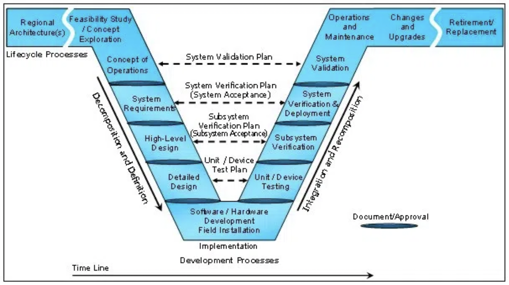

There are many factors to consider when designing data pipelines, which include disparate data sources, dependency management, interprocess monitoring, quality control, maintainability, and timeliness. Toolset choices for each step are incredibly important, and early decisions have tremendous implications on future successes. The following post is meant to be a reference to ask the right questions from the start of the design process, instead of halfway through. In terms of the V-Model of systems engineering, it is intended to fall between the “high level design” and “detailed design” steps:

<!--truncate-->



## Preliminary Considerations

Before selecting toolsets, and certainly before writing any code, there are many subsystem factors and expectations to be taken into account. When designing production-facing data pipelines, you will need to take these factors into consideration.

# Data: Origin, Type, and Timeliness

### Origin

First and foremost, the origin of the data in question must be well understood, and that understanding must be shared across engineers to minimize downstream inconsistencies. Assumptions concerning data structure and interpretation are very hard to work around once they are baked into reports and/or managerial decisions, so it’s incredibly important to get this step right.

Secondly, an investigation into how to get data from the production application must be performed. Can application data be queried/ exported from the production database, in bulk, without detrimentally affecting the user experience? Are you sure about that? Spoiler alert: you'll probably want to set up replication on the production database before the export process is hardened.

### Type

The type of data involved is another important aspect of system design, and data typically falls into one of two categories: event-based and entity data. Event-based data is denormalized, and is used to describe actions over time, while entity data is normalized (in a relational db, that is) and describes the state of an entity at the current point in time. In Ralph Kimball’s data warehousing terminology, event-based data corresponds to facts while entity data corresponds to dimensions.

At first glance, event-based data lends itself to incremental ingestion via high-water marks, while entity data lends itself to bulk ingestion or change data capture. If the normalized data model includes a modified_at (or equivalent) column on entity tables, and it is trustworthy, various entity data can also be ingested incrementally to relieve unnecessary load. Ideally, data should always be incrementally ingested and processed, but reality says that is not always an option.

### Timeliness

How quickly must data be gathered from the production system, and how quickly must it be processed? Data pipelining methodologies will vary widely depending on the desired speed of data ingestion and processing, so this is a very important question to answer prior to building the system. Ideally, event-based data should be ingested almost instantaneously to when it is generated, while entity data can either be ingested incrementally (ideally) or in bulk. If all data ingestion processes are incremental, making the process faster is simply just a matter of running the particular job more often. Therefore, that should be the goal.

Kafka is a very good option for realtime website activity tracking as it was created by Linkedin to do exactly that. It offers the ability for messages to be replayed, incorporates extensive fault-tolerance, can be partitioned, etc. RabbitMQ and Snowplow are other very suitable options, and solve similar problems in slightly different ways.

For pulling data in bulk from various production systems, toolset choices vary widely, depending on what technologies are implemented at the source. In Postgresql, these choices include `COPY (some_query) TO STDOUT WITH CSV HEADER`, a dblink from one database to another, streaming replication via the write-ahead log, or using a `pg_dump --table sometable --no-privileges | some_file.sql` script. Redshift's functionality is very similar, but the system uses S3 as an intermediary to `UNLOAD ('some_query') TO 's3://bucket'`.

# Storage Mechanisms

When it comes to choosing a storage mechanism, the largest factors to be considered include the volume of data and the query-ability of said data (if "query-ability" is indeed a word). If a limited amount of volume is expected, or data is pre-aggregated elsewhere, many storage options will suffice. If incoming data is to be collected in sufficiently large volume or if the storage mechanism must allow for downstream exploratory querying, storage options decrease significantly. If queries are defined beforehand and the volume of data is the limiting factor, Hadoop is a solid alternative. If a high volume of data is to be collected but will be queried in an exploratory way, Redshift is a better alternative. The parity to older versions of Postgres (8.0.2) and the fact that the surface looks/ feels like a regular Postgres database make it very easy to learn and utilize.

### Questions to ask when choosing a storage mechanism

- What level of volume is expected? 200M rows in a single table makes Postgres crawl, especially if it isn’t partitioned. If it is partitioned, queries must be altered accordingly to avoid scanning each partition.
- Will data be exploratorily queried, or are queries defined already and will be semi-static in the future? Tool options and distribution/ sorting strategies will need to be altered accordingly.
- What level of maintenance do you wish to perform? Ideally, engineering resources will go to setting up the system, and future maintenance will be minimal and/or only performed as absolutely necessary.
- Will dashboarding/ analysis tools be pointed at the raw data, or will data be aggregated and moved elsewhere?
- Who will be accessing the data? A system like Hadoop is not ideal for junior analysts with limited SQL/bash knowledge.

# Language Selection

For the sake of developmental speed, maintainability, and parity with various pipelining tools, Python is a very solid language selection. The key component to this is consistency across the system - especially when the team is small. Usually the “Python is slow” argument can be overcome by Python’s multiprocessing or concurrent.futures modules, or by only processing as much as is absolutely necessary. Or by waiting for Intel to optimize for Python. But that's a different story.

Almost every single data pipelining tool has a Python client, and the language allows for future flexibility while maintaining speed of initial development. It also allows for rapid onboarding of new developers, efficient testing with mock, remote bash execution/deployment with fabric, and much more. Companies that continually process enormous amounts of data use Python extensively, and there’s a reason they have selected it as language of choice. Lastly, Airbnb’s Airflow and Spotify’s Luigi are both conveniently written in Python.

# ETL Dependency Management

Dependency management is easy to conceptualize, but a little more difficult to manage across multiple worker nodes or *cough* a Docker Swarm. This is where tools like Luigi, Airflow, and even Jenkins for remote execution scheduling come into play.

### Time-based scheduling

In short, pipeline jobs should never be executed via time-based scheduling. If a one-hour job that is scheduled at 8am fails, all downstream jobs should be aware of that failure and downstream execution should be modified accordingly. If the job starts taking longer than one hour due to increased volume or processing requirements, downstream jobs should be aware and only execute after the upstream job has successfully run. Time-based scheduling cannot efficiently handle either condition, and requires engineers continuously modify the schedule. This wastes time, and is completely unnecessary.

### Single vs. multiple dependencies

If an ETL job only has one upstream dependency, Jenkins is a perfectly suitable tool for linking jobs together. It is quite straight-forward to set up, allows for remote execution on multiple nodes, and is simply a matter of passing the necessary bash script to the job configuration. It also allows for one job to kick off multiple downstream tasks after execution (ie, “load the data you just aggregated to a foreign database, and let the world know it’s happening”).

If an ETL job has multiple upstream dependencies, Jenkins becomes pretty clumsy. It is certainly possible to do so, but it’s not exactly pretty. Luigi and Airflow shine in this respect, because both are built to handle many upstream dependencies for a single job (DAG style).

### Visualizing Dependencies

Jenkins doesn’t even try to visualize the acyclic graph of nested dependencies, while Luigi and Airflow both do. Visualizing the relationships between interconnected jobs is a huge time saver, and allows for the system to grow easily without overloading the ones who built it (and therefore slowing down future development).

### Separation of Concerns

Jenkins is exceptional at job scheduling and handling a limited set of single dependencies, and that is all. Luigi is extremely good at multiple dependency handling and visualization, but it doesn’t even attempt to handle scheduling execution of the initial job in the acyclic graph. Airflow tries to do everything including job duration monitoring, plotting job execution overlap via Gantt charts, scheduling, and dependency management. In my opinion (I warned you I was opinionated), job durations and overlap are ideally tracked and handled elsewhere, alongside other pipeline instrumentation.

### Balancing dependency management with job overload

If a job dependency tool is used, every minuscule item of the ETL process should be not wrapped in a task. For example, if ten tables are to be exported from a remote database, and all must be exported before downstream tasks run, there should not be an import job for each of the ten tables. There should be one job that imports all the designated tables. This allows for the dependency graph to remain clean, code to be well-written and easily maintainable, etc.

# Fault Tolerance

### Persistence in message-based ingestion

If incoming event data is message-based, a key aspect of system design centers around the inability to lose messages in transit, regardless of what point the ingestion system is in. Message queues with delivery guarantees are very useful for doing this, since a consumer process can crash and burn without losing data and without bringing down the message producer. Alternatively, the producer process can crash and burn, and the consumer will see nothing but the fact that no new messages have come in. Messages in transit should always be persisted to disk (if space and time allows) so that if the broker/queue goes down, it can be brought back up without losing data.

If done right, this method of data ingestion is extremely fault-tolerant and scalable. There are some key differences between various pub/sub systems (persistence, replayability, distributed commit log vs. queue), but that is a separate conversation.

### Stop-on-error in bulk processing

Fault tolerance is a key aspect of any data pipeline, and downstream tasks should always be aware of upstream tasks failing. Data pipelining is one place where exceptions should not always be handled in code, and engineers should know about any error in the system immediately. The main place exceptions should be handled is when retrying a task for a designated period of time (or number of retries/ exponential back-off). This is so that downstream jobs don’t run and mistakenly cause additional harm to data quality. The system should stop immediately when a fault is detected if downstream jobs depend on it.

### Idempotence and replayability

Bulk pipeline jobs should always be created so that they are able to be re-run immediately in case of failure, and entirely idempotent. No matter how many times a particular job is run, it should always produce the same output with a given input, and should not persist duplicate data to the destination. Want math?

```f(f(x)) = f(x)```

# Architectural separation of concerns

In short, a production web application should never be dependent on a reporting database and/or data warehouse. This creates an unnecessary dependency which is inflexible for maintenance and increases the level of risk.

# Pipeline Monitoring

As with any system, individual steps should be extensively instrumented and monitored. If they are not, it is nearly impossible to eliminate personal opinion and accurately determine the facts of system operation. A good starting point is to measure the time which a particular job started, stopped, total runtime, state of completion, and any pertinent error messages.

### Start and stop time

This one is pretty straight-forward, as the difference is used to calculate runtime. Logging start time of jobs is very useful on its own, however, since it adds a linear aspect to job execution (even if the jobs are executed in parallel). When debugging a step of the pipeline, it’s very helpful to see when the jobs were executed, in order by which they were kicked off. It also allows for easy visualization if need be.

### Runtime

This metric is also obvious yet incredibly powerful for determining the current state of the world, proactive system improvements, and early warning signs for future problems. The following insight is realized, simply by measuring runtime:

- Determination of system bottlenecks
- Early-warning signs for jobs trending upwards, relative to other jobs
- Statistically-benchmarked improvements
- Determination of the effects on a particular system from external variables (server, network, etc)
- Job completion and error logging

Pipeline instrumentation not only allows for efficient debugging, early warning signs, and proactive improvements to the system, but it also allows the engineers to see progress over time. It also can be very easily used to expose various system statistics to outside parties, so that system scale can be easily and effectively communicated.

# Pipeline Monitoring Tools

Monitoring each portion of the pipeline, as well as aggregate statistics, can be done in a variety of ways. Graphite was built to handle this type of data, but even a table that stores system metrics is much better than nothing all all. The combination of instrumentation decorators (in Python at least) and various signals being sent to Graphite is ideal. InfluxDB is another way to build instrumentation directly into your data pipelines.

For system instrumentation visualizations, I highly recommend Grafana.

# Accessibility and Visualization

### Tools

There are many tools out there for accessing and visualizing data. For data exploration and team collaboration, tools like Wagon are great. For dashboarding and sharing data, Periscope is a good choice. When selecting a tool, it is ideal if the code involved is not proprietary to that particular tool. That is, the entire company shouldn’t be bound to a tool, simply because it uses a sql variant that is too painful to rewrite. Another key consideration is the ease of use for non-technical or semi-technical people. In order to proliferate a data-centric mindset across the organization, the tool must be relatively straight-forward to use and build upon. Also, it doesn’t really make sense to build out a proprietary visualization tool when time-series or bar charts powered by sql will suffice.

### Database role topology

When analysts and other dashboarding tools are allowed access to the same database as your various ETL tools, it is of utmost importance to grant them the minimum permissions necessary to perform the designated job function. In short, an analyst should never be able to inadvertently UPDATE event records coming from a production system, and a dashboarding tool should never be allowed the privileges necessary to issue a DROP TABLE statement. A flexible role topology allows the freedom for each of these groups to do what they need to do, but no more.

# System constraints

There are many constraints to consider, and pipeline creation largely depends on data sources, deployment environment, associated networks, etc. If the source data/ production application is all on AWS, it doesn’t make sense to spin up a physical server in the office for the pipeline. AWS offers plenty of tools for moving data within the system itself (as well as the cost implications when keeping AWS-generated data inside AWS). Alternatively, if the application lives on a VM, hosted in the office, it makes sense to spin up another VM on the same subnet for pipelining. Since constraints are entirely dependent on the existing system in which to gather data from, it would simply be impossible to cover all them in a simple paragraph. That's where a little human creativity goes a long way.

# Conclusion

In conclusion, there are a plethora of options to consider when building out a data pipelining system. There are many pros and cons to each alternative, and this document outlines some of the major factors involved. I hope it helps, and at the very least, provokes questions and thoughtful system design. If thought through from the start, many system inefficiencies can be avoided, and the power associated with efficient, reliable data collection can rapidly come to fruition.
