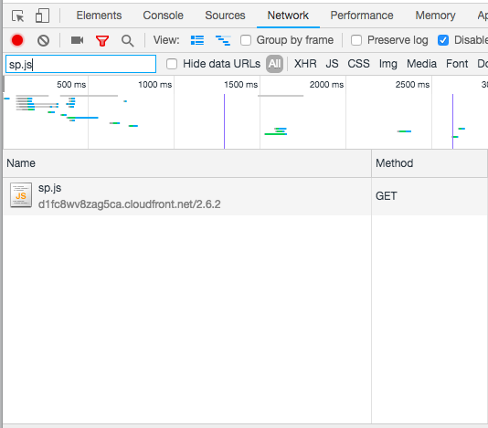
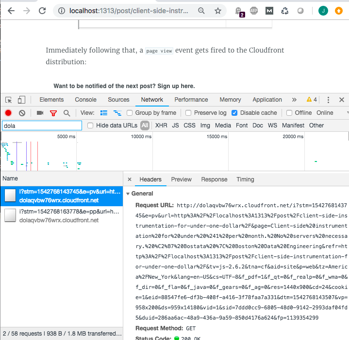
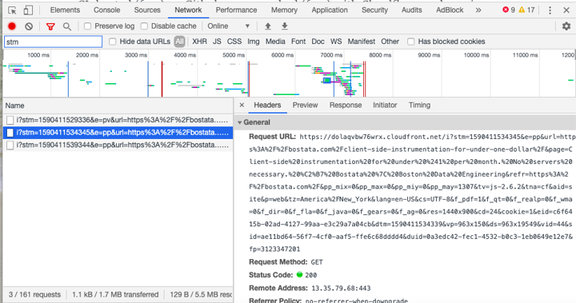
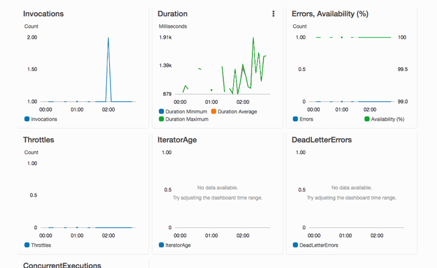
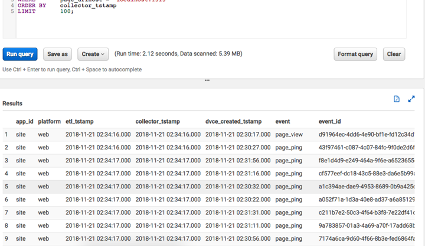

In a world where the importance of data is steadily increasing yet the cost of computing power is steadily decreasing, there are fewer and fewer excuses to not have control of your own data. To explore that point I instrumented this site as inexpensively as I possibly could, without sacrificing reliability or functionality. I have full control of all data that is generated, the instrumentation is highly customizable, the output is simple to use, and I don't have to be available at all hours to keep it working.

The components utilized include Cloudfront, S3, Lambda, Athena, and the Snowplow Javascript tracker.

**And It costs less than $1 per month.**

<!--truncate-->

### Before getting started.... what does the system need?

- Easy javascript tracking integration, with no impact on site performance.
- Absolute minimization of resources for me to manage, pay for, and worry about.
- Rock-solid pipeline reliability.

So let's get started...

# No servers.

A good stream-based analytics infrastructure is a beautiful thing when it's done correctly, but there's always overhead involved. You'll need streams, you'll need collection servers sitting behind a load balancer/reverse proxy, you'll need machines solely responsible for enrichment, you'll need infrastructure for monitoring infrastructure, you'll need engineers who demand salaries, and.... you get the idea.

For this site I don't have any intention of modifying functionality or making decisions based on what visitors are doing "right now", so stream-based infrastructure just introduces overhead and is out of the question. Millisecond-level latency to the eventual data store (like in a stream-based approach) would be nice, but minute-level latency is perfectly ok.

# No monitoring.

Blasphemy! Or... maybe not. Instead of setting up lots of infrastructure that must be continually monitored, all instrumentation infrastructure leans heavily on AWS functionality. By taking advantage of various AWS built-ins (with a high level of reliability), I was able to skip a lot of overhead that would otherwise be required.

Cloudfront includes the ability to forward access logs to an S3 bucket.

Lambda triggers ensure at-least-once notification of a predefined event (like when a file lands in S3).

S3 provides 99.999999999% durability and 99.99% availability on a yearly SLA.

# No fees (almost).

The current cost of this system is fairly satisfying, but my favorite part is the fact that site traffic would have to increase significantly before cost increases beyond what I'm willing to pay.

Cloudfront costs ~$0.085 per GB out to the internet, ~$0.020 per GB out to origin, and $0.0075 per 10,000 requests.

**Total Cloudfront cost this month: $0.03**

Lambda is free up to 1M requests and 3.2M seconds of compute time, per month.

**Total Lambda cost this month: $0.00**

S3 costs $0.023 per GB, per month, $0.01 per 1,000 PUT/COPY/POST requests, and $0.001 per 1,000 GET/SELECT requests.

**Total S3 cost this month: $0.27**

Athena costs $5 per TB of data scanned.

**Total Athena cost this month: $0.01**

# Quick and easy data access.

As data volume grows, I need to be able to query all data quickly and effectively in a primarily-ad-hoc fashion. AWS Athena is effectively presto-as-a-service, and an external table backed by S3 was a straight-forward, inexpensive way forward.

Putting a visualization layer like Quicksight on top of Athena is very simple.

# How it is implemented.

### Step #1 - AWS Cloudfront Distribution

The first step of setting up instrumentation requires creating two S3 buckets and a Cloudfront distribution. I've automated the setup with Terraform, and the block of code for doing so (not including tfvars/etc) looks like the following:

```
resource "aws_s3_bucket" "src" {
  bucket = "${var.env}-${var.owner}-${var.system_tag}-lt-src"
  acl    = "public-read"
  tags {
    Name   = "${var.env}-${var.owner}-${var.system_tag}-lt-src"
    Env    = "${var.env}"
    System = "${var.system_tag}"
    Owner  = "${var.owner}"
  }
}

resource "aws_s3_bucket_object" "object" {
  bucket       = "${aws_s3_bucket.src.bucket}"
  key          = "i"
  source       = "${"${path.module}/files/i"}"
  etag         = "${md5(file("${path.module}/files/i"))}"
  acl          = "public-read"
  content_type = "image/gif"
}

resource "aws_s3_bucket" "logs" {
  bucket = "${var.env}-${var.owner}-${var.system_tag}-lt-logs"
  acl    = "private"
  tags {
    Name   = "${var.env}-${var.owner}-${var.system_tag}-lt-logs"
    Env    = "${var.env}"
    System = "${var.system_tag}"
    Owner  = "${var.owner}"
  }
}

resource "aws_cloudfront_distribution" "log_distribution" {
  origin {
    domain_name = "${aws_s3_bucket.src.bucket_regional_domain_name}"
    origin_id   = "S3-${aws_s3_bucket.src.bucket}"
  }
  enabled         = true
  is_ipv6_enabled = true
  comment         = "Cloudfront distribution for snowplow tracking pixel"
  logging_config {
    include_cookies = true
    bucket          = "${aws_s3_bucket.logs.bucket_regional_domain_name}"
    prefix          = "RAW"
  }
  aliases = ["sp.${var.env}.${var.primary_domain}"]
  default_cache_behavior {
    allowed_methods  = ["GET", "HEAD"]
    cached_methods   = ["GET", "HEAD"]
    target_origin_id = "S3-${aws_s3_bucket.src.bucket}"
    forwarded_values {
      query_string = true
      cookies {
        forward = "all"
      }
    }
    viewer_protocol_policy = "allow-all"
    min_ttl                = 0
    default_ttl            = 3600
    max_ttl                = 86400
  }
  restrictions {
    geo_restriction {
      restriction_type = "whitelist"
      locations        = ["AF", "AX", "AL", "DZ", "AS", "AD", "AO", "AI", "AQ", "AG", "AR", "AM", "AW", "AU", "AT", "AZ", "BS", "BH", "BD", "BB", "BY", "BE", "BZ", "BJ", "BM", "BT", "BO", "BA", "BW", "BV", "BR", "IO", "BN", "BG", "BF", "BI", "CV", "KH", "CM", "CA", "KY", "CF", "TD", "CL", "CN", "CX", "CC", "CO", "KM", "CG", "CD", "CK", "CR", "CI", "HR", "CU", "CW", "CY", "CZ", "DK", "DJ", "DM", "DO", "EC", "EG", "SV", "GQ", "ER", "EE", "SZ", "ET", "FK", "FO", "FJ", "FI", "FR", "GF", "PF", "TF", "GA", "GM", "GE", "DE", "GH", "GI", "GR", "GL", "GD", "GP", "GU", "GT", "GG", "GN", "GW", "GY", "HT", "HM", "VA", "HN", "HK", "HU", "IS", "IN", "ID", "IR", "IQ", "IE", "IM", "IL", "IT", "JM", "JP", "JE", "JO", "KZ", "KE", "KI", "KP", "KR", "KW", "KG", "LA", "LV", "LB", "LS", "LR", "LY", "LI", "LT", "LU", "MO", "MK", "MG", "MW", "MY", "MV", "ML", "MT", "MH", "MQ", "MR", "MU", "YT", "MX", "FM", "MD", "MC", "MN", "ME", "MS", "MA", "MZ", "MM", "NA", "NR", "NP", "NL", "NC", "NZ", "NI", "NE", "NG", "NU", "NF", "MP", "NO", "OM", "PK", "PW", "PA", "PG", "PY", "PE", "PH", "PN", "PL", "PT", "PR", "QA", "RE", "RO", "RU", "RW", "BL", "KN", "LC", "MF", "PM", "VC", "WS", "SM", "ST", "SA", "SN", "RS", "SC", "SL", "SG", "SX", "SK", "SI", "SB", "SO", "ZA", "GS", "SS", "ES", "LK", "SD", "SR", "SJ", "SE", "CH", "SY", "TJ", "TH", "TL", "TG", "TK", "TO", "TT", "TN", "TR", "TM", "TC", "TV", "UG", "UA", "AE", "GB", "US", "UM", "UY", "UZ", "VU", "VE", "VN", "VG", "VI", "WF", "EH", "YE", "ZM", "ZW"]
    }
  }

  tags {
    Name   = "${var.env}-${var.owner}-${var.system_tag}-log-dist"
    Env    = "${var.env}"
    System = "${var.system_tag}"
    Owner  = "${var.owner}"
  }

  viewer_certificate {
    cloudfront_default_certificate = true
  }
}
```

This Cloudfront distribution serves a gif titled "i" from S3, which becomes the tracking endpoint. All access logs are then forwarded to another S3 bucket where they are subsequently processed.

### Step #2 - Snowplow Javascript Tracker

I am a huge fan of Snowplow. Integration is easy, functionality is rich, fault tolerance is built-in, and I know from experience that the system works very, very well.

Page views, page pings, link clicks, and forms are tracked by default. I've also added custom structured events for tracking specific actions that are otherwise uninstrumented.

The Javascript tracking code gets included in the ```<head>``` of every page, and looks like the following:

```
<script type="text/javascript">
  ;(function(p,l,o,w,i,n,g){if(!p[i]){p.GlobalSnowplowNamespace=p.GlobalSnowplowNamespace||[];
  p.GlobalSnowplowNamespace.push(i);p[i]=function(){(p[i].q=p[i].q||[]).push(arguments)
  };p[i].q=p[i].q||[];n=l.createElement(o);g=l.getElementsByTagName(o)[0];n.async=1;
  n.src=w;g.parentNode.insertBefore(n,g)}}(window,document,"script","//d1fc8wv8zag5ca.cloudfront.net/2.6.2/sp.js","snowplow"));


  window.snowplow('newTracker', 'cf', 'dolaqvbw76wrx.cloudfront.net', {
    appId: 'site',
    cookieDomain: 'bostata.com',
  });
  window.snowplow('enableActivityTracking', 1, 5);
  window.snowplow('trackPageView');
  window.snowplow('enableLinkClickTracking');
  window.snowplow('enableFormTracking');
</script>
```

### Step #3 - AWS Lambda

The next aspect of this infrastructure is a Lambda function that listens to the Cloudfront distribution log bucket for any ObjectCreated event, processes all incoming access logs, appends rich context to them (geoip, useragent parser, query parameter parsing, etc), formats these records in a consistent manner to the Snowplow canonical event model, and persists formatted records back to the log bucket as gzipped json files.

Up to 1000 concurrent instances of this function can be running at any time, and each instance is limited to 128mb of memory.

### Step #4 - AWS Athena

It's fun to watch data pile up in S3, but the value of said data is very low if it's difficult to access. Athena allows you to query S3 buckets quickly and easily via external tables... and the price is right. Creating a table for the Snowplow canonical event model is pretty simple:

```
CREATE EXTERNAL TABLE default.events
(
  app_id string,
  platform string,
  etl_tstamp timestamp,
  collector_tstamp timestamp,
  dvce_created_tstamp timestamp,
  event string,
  event_id string,
  txn_id string,
  name_tracker string,
  v_tracker string,
  v_collector string,
  v_etl string,
  user_id string,
  user_ipaddress string,
  user_fingerprint string,
  domain_userid string,
  domain_sessionidx string,
  network_userid string,
  geo_country string,
  geo_region string,
  geo_city string,
  geo_zipcode string,
  geo_latitude string,
  geo_longitude string,
  geo_region_name string,
  ip_isp string,
  ip_organization string,
  ip_domain string,
  ip_netspeed string,
  page_url string,
  page_title string,
  page_referrer string,
  page_urlscheme string,
  page_urlhost string,
  page_urlport string,
  page_urlpath string,
  page_urlquery string,
  page_urlfragment string,
  refr_urlscheme string,
  refr_urlhost string,
  refr_urlport string,
  refr_urlpath string,
  refr_urlquery string,
  refr_urlfragment string,
  refr_medium string,
  refr_source string,
  refr_term string,
  mkt_medium string,
  mkt_source string,
  mkt_term string,
  mkt_content string,
  mkt_campaign string,
  contexts string,
  se_category string,
  se_action string,
  se_label string,
  se_property string,
  se_value string,
  unstruct_event string,
  tr_orderid string,
  tr_affiliation string,
  tr_total string,
  tr_tax string,
  tr_shipping string,
  tr_city string,
  tr_state string,
  tr_country string,
  ti_orderid string,
  ti_sku string,
  ti_name string,
  ti_category string,
  ti_price string,
  ti_quantity string,
  pp_xoffset_min string,
  pp_xoffset_max string,
  pp_yoffset_min string,
  pp_yoffset_max string,
  useragent string,
  br_name string,
  br_family string,
  br_version string,
  br_type string,
  br_renderengine string,
  br_lang string,
  br_features_pdf string,
  br_features_flash string,
  br_features_java string,
  br_features_director string,
  br_features_quicktime string,
  br_features_realplayer string,
  br_features_windowsmedia string,
  br_features_gears string,
  br_features_silverlight string,
  br_cookies string,
  br_colordepth string,
  br_viewwidth string,
  br_viewheight string,
  os_name string,
  os_family string,
  os_manufacturer string,
  os_timezone string,
  dvce_type string,
  dvce_ismobile string,
  dvce_screenwidth string,
  dvce_screenheight string,
  doc_charset string,
  doc_width string,
  doc_height string,
  tr_currency string,
  tr_total_base string,
  tr_tax_base string,
  tr_shipping_base string,
  ti_currency string,
  ti_price_base string,
  base_currency string,
  geo_timezone string,
  mkt_clickid string,
  mkt_network string,
  etl_tags string,
  dvce_sent_tstamp timestamp,
  refr_domain_userid string,
  refr_dvce_tstamp timestamp,
  derived_contexts string,
  domain_sessionid string,
  derived_tstamp timestamp,
  event_vendor string,
  event_name string,
  event_format string,
  event_version string,
  event_fingerprint string,
  file_name string
)
ROW FORMAT  serde 'org.apache.hive.hcatalog.data.JsonSerDe'
LOCATION    's3://prod-logs-bucket/PROCESSED';
```

# See it at work

Since it's always fun to see a system working in the wild, let's watch exactly how this instrumentation works. I'm using the developer tools on Chrome to inspect browser network traffic.

Each time a page is loaded, the browser requests a sp.js file that's cached in Cloudfront as seen here:



Immediately following that, a page view event gets fired to the Cloudfront distribution that was set up above:



A page ping event fires to the Cloudfront distribution every five seconds, and indicates that I'm still actively reading or scrolling:



With all of this wonderful tracking, the Lambda function will start going to work:



And by the time you've reached this point, the data will be readily accessible in S3 and queryable via Athena:




# In conclusion

Overall, I'd say this exploration has been a big win. Client-side site instrumentation typically requires significant setup and maintenance overhead, but this methodology is the exact opposite. It's cheap. It's fast. It's quick to set up. It's reliable. It's flexible. And it just works.

The price of system operation will continue to be minimal, the data stays close-to-home, and I don't have to think about data pipeline issues.

And all for under $1 per month.
