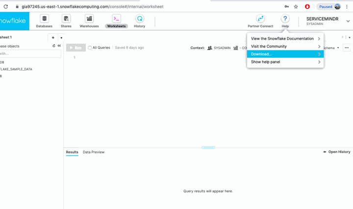
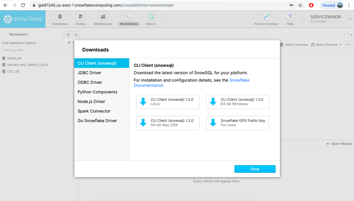
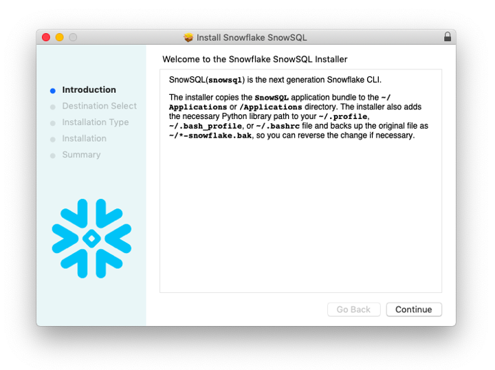
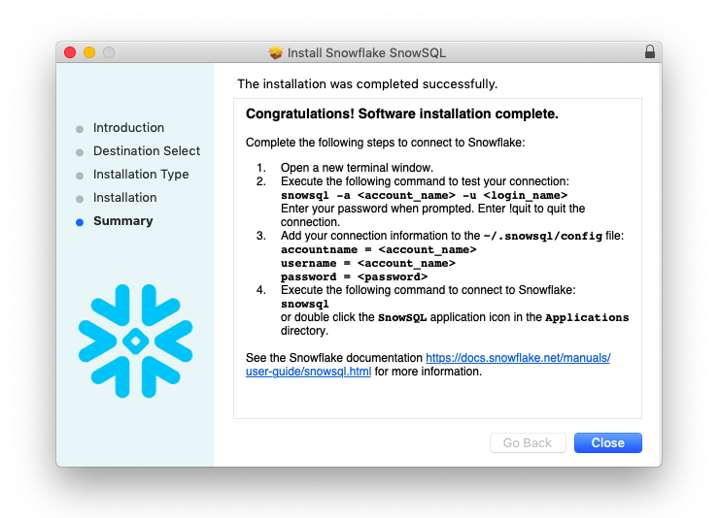

[SnowSQL](https://docs.snowflake.com/en/user-guide/snowsql.html) is the command-line interface for accessing your Snowflake instance.

The following is a quick "how to" guide for setting it up.

<!--truncate-->

### Installation

After logging into your Snowflake web interface, the SnowSQL installer is available via `Help` -> `Download`:



You'll need to select the appropriate version for your machine:



..and install it:





To verify installation, simply open a terminal window and run snowsql. If installed properly, you will receive a list of connection and option flags:

```
$ snowsql
    Usage: snowsql [OPTIONS]

    Options:
      -a, --accountname TEXT          Name assigned to your Snowflake account. If
                                      you are not on us-west-2 or AWS deployement,
                                      append the region and platform to the end,
                                      e.g., <account>.<region> or
                                      <account>.<region>.<platform>Honors
                                      $SNOWSQL_ACCOUNT.
      -u, --username TEXT             Username to connect to Snowflake. Honors
                                      $SNOWSQL_USER.
      -d, --dbname TEXT               Database to use. Honors $SNOWSQL_DATABASE.
      -s, --schemaname TEXT           Schema in the database to use. Honors
                                      $SNOWSQL_SCHEMA.
      -r, --rolename TEXT             Role name to use. Honors $SNOWSQL_ROLE.
      -w, --warehouse TEXT            Warehouse to use. Honors $SNOWSQL_WAREHOUSE.
      -h, --host TEXT                 Host address for the connection. Honors
                                      $SNOWSQL_HOST.
      -p, --port INTEGER              Port number for the connection. Honors
                                      $SNOWSQL_PORT.
      --region TEXT                   (DEPRECATED) Append the region or any sub
                                      domains before snowflakecomputing.com to the
                                      end of accountname parameter after a dot.
                                      e.g., accountname=<account>.<region>
      -m, --mfa-passcode TEXT         Token to use for multi-factor authentication
                                      (MFA)
      --mfa-passcode-in-password      Appends the MFA passcode to the end of the
                                      password.
      --abort-detached-query          Aborts a query if the connection between the
                                      client and server is lost. By default, it
                                      won't abort even if the connection is lost.
      --probe-connection              Test connectivity to Snowflake. This option
                                      is mainly used to print out the TLS/SSL
                                      certificate chain.
      --proxy-host TEXT               (DEPRECATED. Use HTTPS_PROXY and HTTP_PROXY
                                      environment variables.) Proxy server
                                      hostname. Honors $SNOWSQL_PROXY_HOST.
      --proxy-port INTEGER            (DEPRECATED. Use HTTPS_PROXY and HTTP_PROXY
                                      environment variables.) Proxy server port
                                      number. Honors $SNOWSQL_PROXY_PORT.
      --proxy-user TEXT               (DEPRECATED. Use HTTPS_PROXY and HTTP_PROXY
                                      environment variables.) Proxy server
                                      username. Honors $SNOWSQL_PROXY_USER. Set
                                      $SNOWSQL_PROXY_PWD for the proxy server
                                      password.
      --authenticator TEXT            Authenticator: 'snowflake',
                                      'externalbrowser' (to use any IdP and a web
                                      browser), or
                                      https://<your_okta_account_name>.okta.com
                                      (to use Okta natively).
      -v, --version                   Shows the current SnowSQL version, or uses a
                                      specific version if provided as a value.
      --noup                          Disables auto-upgrade for this run. If no
                                      version is specified for -v, the latest
                                      version in ~/.snowsql/ is used.
      -D, --variable TEXT             Sets a variable to be referred by &<var>. -D
                                      tablename=CENUSTRACKONE or --variable
                                      db_key=$DB_KEY
      -o, --option TEXT               Set SnowSQL options. See the options
                                      reference in the Snowflake documentation.
      -f, --filename PATH             File to execute.
      -q, --query TEXT                Query to execute.
      --config PATH                   Path and name of the SnowSQL configuration
                                      file. By default, ~/.snowsql/config.
      -P, --prompt                    Forces a password prompt. By default,
                                      $SNOWSQL_PWD is used to set the password.
      -M, --mfa-prompt                Forces a prompt for the second token for
                                      MFA.
      -c, --connection TEXT           Named set of connection parameters to use.
      --single-transaction            Connects with autocommit disabled. Wraps
                                      BEGIN/COMMIT around statements to execute
                                      them as a single transaction, ensuring all
                                      commands complete successfully or no change
                                      is applied.
      --private-key-path PATH         Path to private key file in PEM format used
                                      for key pair authentication. Private key
                                      file is required to be encrypted and
                                      passphrase is required to be specified in
                                      environment variable
                                      $SNOWSQL_PRIVATE_KEY_PASSPHRASE
      -U, --upgrade                   Force upgrade of SnowSQL to the latest
                                      version.
      -K, --client-session-keep-alive
                                      Keep the session active indefinitely, even
                                      if there is no activity from the user..
      --disable-request-pooling       Disable request pooling. This can help speed
                                      up connection failover
      -?, --help                      Show this message and exit.
```

# Configuration

As indicated above, SnowSQL has a host of connection params and settings, and allows variable declaration and substitution. You won't need to be familiar with all the options to hit the ground running, but I definitely recommend leveraging ~/.snowsql/config to persist your connection details and personal preferences.

### Add your connection details to the `connections` section of `~/.snowsql/config`.

The first few lines of your ~/.snowsql/config file should look like the following:

```
[connections]
accountname = YOUR_ACCOUNT_NAME
username = YOUR_USERNAME
password = YOUR_PASSWORD
```

Please note! There are some caveats regarding quote-wrapping special characters and escaping quotes within passwords. For more information, please consult the [docs located here](https://docs.snowflake.com/en/user-guide/snowsql-config.html).

### Add your personal preferences to the [options] section.

I'm OK with most of the configuration defaults, so the only option I typically modify is sfqid. It enables output of snowflake query id's in the summary, which can be quite helpful:

```
    [options]
    sfqid = True
```

**Want to be unfriendly? Add:**

```
friendly = False
```

**Want to write to a specific log location? Add:**

```
log_file = your/path/to/log
```

**Want to be difficult? Add:**

```
editor = emacs
```

(just kidding)

You get the idea. Your mileage may vary.


### Lock the file down to you and only you.

If you've been paying attention, you have already realized sensitive credentials are stored in plaintext on your machine. This is not a reason to ?, and is similar to the postgres pgpass file. You'll want to lock it down.

```chmod 400 ~/.snowsql/config```


# Summary

SnowSQL is pretty easy to set up and start using, and you'll probably find it quickly becomes critical for development and database administration workflows. After installing the tool and becoming familiar with how it is configured and utilized, you'll be well on your way to a pleasant experience.

